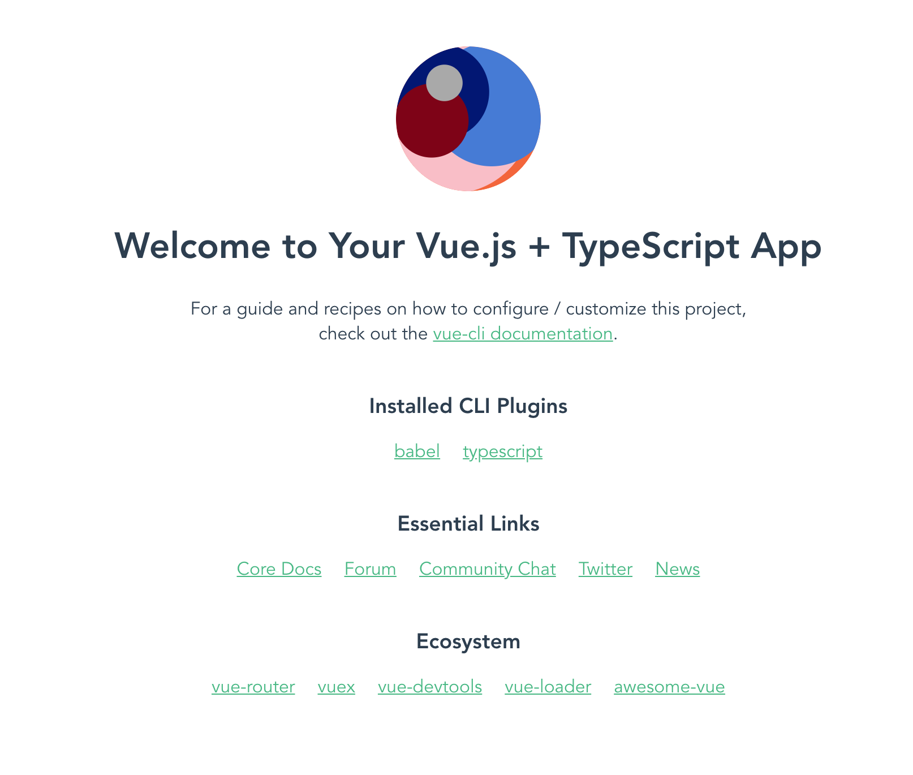

## Getting started

In this tutorial how to make your first Vue app with Typescript.
Make sure you have [node.js](https://nodejs.org/en/download/) and [vue-cli](https://cli.vuejs.org/guide/installation.html) installed.

### Creating app

To create a new project, run:

```bash
vue create name-of-my-app
```

You will be prompted to pick a preset. Choose "Manually select features" to pick the features you need.


From features we pick Babel, Typescript. We also recommend to pick Vuex (for vue-settings), Router (for subpages) and linter (code checker, but it can be very tricky)


After picking features you will be prompted to choose class component or not. We definitelly recommend it as it is very easy to use. Press `Y` for yes


You will then asked if you want to use Babel alongside with Typescript press `Y` for yes.
We also prefer to place config in dedicated files. It makes code more cleaner


After installation just change directory with
```bash
cd name-of-my-app
```

and run with

```
yarn serve
```

open the source code in your favourite text editor (We love [Visual Studio Code](https://code.visualstudio.com/Download)).

### Creating first component

No we will create our firs Vue typescript component using vue-identicon

in `src/components/` we create `IdenticonImage.vue` you can copy the snippet bellow

```html

<template>
  <div>
    IdenticonImage works!
  </div>
</template>

<script lang="ts">
import { Component, Prop, Vue } from 'vue-property-decorator';

@Component
export default class IdenticonImage extends Vue {
}
</script>

```


In `App.vue` we now import `IdenticonImage` under `HelloWorld` import.
```
import IdenticonImage from './components/IdenticonImage.vue';
```

also we can't forget to register our component, so simply add `IdenticonImage` inside `@Component` annotation like:

```
@Component({
  components: {
    HelloWorld,
    IdenticonImage
  },
})
```

now we can show IdenticonImage inside our template, replace `` tag with:
```
<IdenticonImage />
```

How should `App.vue` look like.

```html

<template>
  <div id="app">
    <IdenticonImage />
    <HelloWorld msg="Welcome to Your Vue.js + TypeScript App"/>
  </div>
</template>

<script lang="ts">
import { Component, Vue } from 'vue-property-decorator';
import HelloWorld from './components/HelloWorld.vue';
import IdenticonImage from './components/IdenticonImage.vue';

@Component({
  components: {
    HelloWorld,
    IdenticonImage
  },
})
export default class App extends Vue {}
</script>

<style>
#app {
  font-family: 'Avenir', Helvetica, Arial, sans-serif;
  -webkit-font-smoothing: antialiased;
  -moz-osx-font-smoothing: grayscale;
  text-align: center;
  color: #2c3e50;
  margin-top: 60px;
}
</style>

```

### Adding vue-identicon to project

Now open another terminal and type down

```
yarn add @vue-polkadot/vue-identicon
```

this command will install `vue-identicon` package which we can use in our `IdenticonImage.vue`.
We will import vue-identicon like:
```
import Identicon from '@vue-polkadot/vue-identicon';
```

register the `Identicon` component in `@Component` annotation:

```
@Component({
  components: {
    Identicon
  }
})
```

and add to teplate.
There are 3 properties for `Identicon`:
 - size
 - theme
 - value: represents polkadot's ss58 address -> for generation use [Subkey](https://subkey.netlify.com/)

 Our final `IdenticonImage.vue` component:

```html

<template>
  <div>
    <Identicon
      size="128"
      value='5F1aGzHi5uJkRdegzBNj4fhG81ZtrWS79TrErTa7qL7ih4ik'
      theme='beachball'
    />
  </div>
</template>

<script lang="ts">
import { Component, Prop, Vue } from 'vue-property-decorator';
import Identicon from '@vue-polkadot/vue-identicon';

@Component({
  components: {
    Identicon
  }
})
export default class IdenticonImage extends Vue {
}
</script>

```
What we should see now:




### Summary

We learned:
- How to create our own component in Vue with Typescript
- How to install add package to our project


